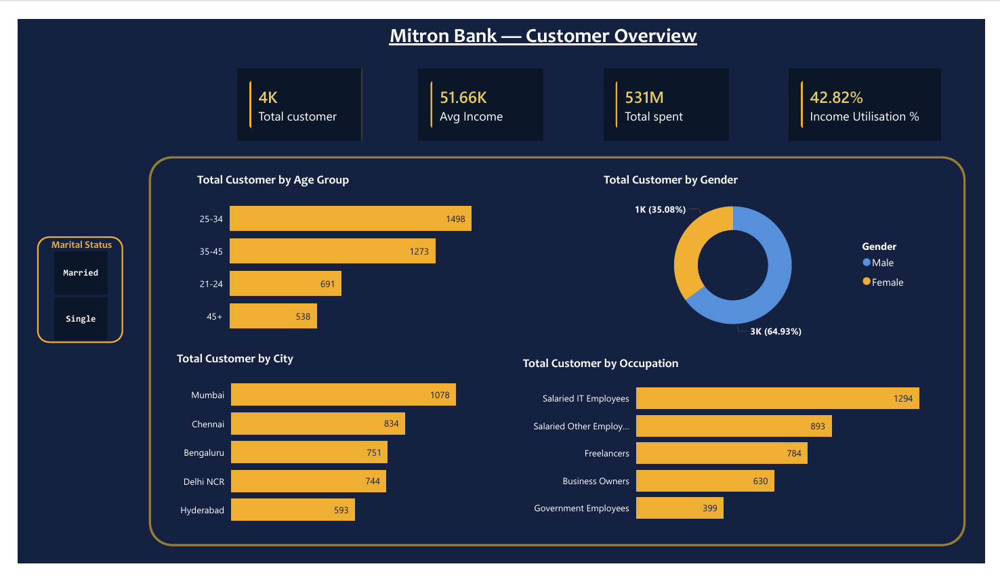
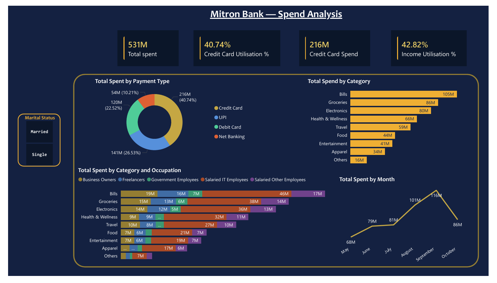
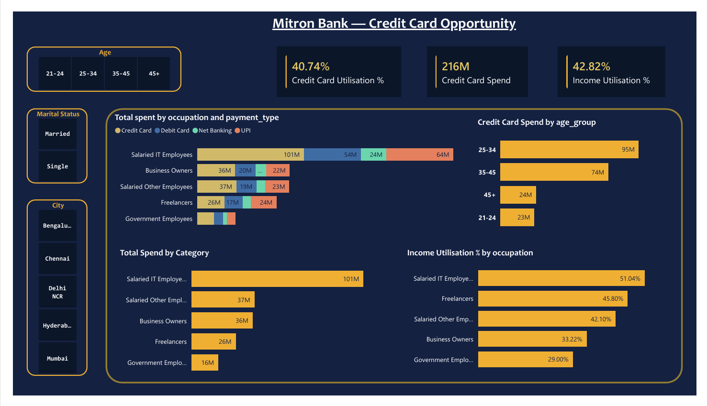

# Mitron Bank — Credit Card Campaign Analytics


## Project Overview

Mitron Bank is a legacy financial institution headquartered in Hyderabad looking to introduce a new line of credit cards. As a data analyst at AtliQ Data Services, I analysed a sample dataset of 4,000 customers across 5 cities to identify high-value segments and provide actionable recommendations to guide the credit card product strategy.

This project was part of the **Codebasics Resume Project Challenge #8**.

---

## Business Objective

Identify which customer segments are most likely to adopt and actively use a new credit card — and recommend what features the card should offer based on real spend behaviour.

---

## Tools & Technologies

| Tool | Usage |
|------|-------|
| MySQL | Customer segmentation, spend analysis, income utilisation queries |
| Power BI Desktop | 3-page interactive dashboard |
| DAX | Custom measures — Income Utilisation %, Credit Card Utilisation %, CALCULATE-based filters |
| Power Query | Data transformation, month sort column |

---

## Dataset

| Table | Rows | Description |
|-------|------|-------------|
| `dim_customers` | 4,000 | Customer demographics — age group, city, occupation, gender, marital status, avg income |
| `fact_spends` | 864,000 | Monthly spend data — category, payment type, amount across 6 months (May–Oct) |

---

## Dashboard Pages

### Page 1 — Customer Overview


Key metrics: Total Customers, Avg Income, Total Spend, Income Utilisation %
Visuals: Customer distribution by age group, city, occupation, and gender split

### Page 2 — Spend Analysis


Key metrics: Total Spend, Credit Card Utilisation %, Credit Card Spend, Income Utilisation %
Visuals: Spend by payment type, spend by category, spend by category × occupation (stacked), monthly spend trend

### Page 3 — Credit Card Opportunity


Key metrics: Credit Card Utilisation %, Credit Card Spend, Income Utilisation %
Visuals: Spend by occupation × payment type, credit card spend by age group, income utilisation by occupation
Slicers: Age group, city, marital status

---

## Key SQL Queries

### Income Utilisation % by Occupation
```sql
WITH customer_spend AS (
    SELECT customer_id, SUM(spend) AS total_spend
    FROM fact_spends
    GROUP BY customer_id
)
SELECT
    C.occupation,
    ROUND(AVG(C.avg_income), 0) AS avg_income,
    ROUND(SUM(CS.total_spend), 0) AS total_spend,
    ROUND(SUM(CS.total_spend) /
        (AVG(C.avg_income) * 6 * COUNT(C.customer_id)) * 100.0, 1) AS income_utilisation_pct
FROM dim_customers C
JOIN customer_spend CS ON C.customer_id = CS.customer_id
GROUP BY C.occupation
ORDER BY income_utilisation_pct DESC;
```

### Spend by Category
```sql
SELECT
    category,
    SUM(spend) AS total_spend,
    ROUND(SUM(spend) /
        (SELECT SUM(spend) FROM fact_spends) * 100.0, 1) AS pct_of_total
FROM fact_spends
GROUP BY category
ORDER BY total_spend DESC;
```

### Payment Type Split
```sql
SELECT
    payment_type,
    SUM(spend) AS total_spend,
    ROUND(SUM(spend) /
        (SELECT SUM(spend) FROM fact_spends) * 100.0, 1) AS pct_of_total
FROM fact_spends
GROUP BY payment_type
ORDER BY total_spend DESC;
```

---

## Key DAX Measures

```dax
Total Spend = SUM(fact_spends[spend])

Total Customers = DISTINCTCOUNT(dim_customers[customer_id])

Income Utilisation % =
DIVIDE(
    [Total Spend],
    SUMX(dim_customers, dim_customers[avg_income]) * 6
) * 100

Credit Card Spend =
CALCULATE(
    [Total Spend],
    fact_spends[payment_type] = "Credit Card"
)

Credit Card Utilisation % =
DIVIDE([Credit Card Spend], [Total Spend]) * 100
```

---

## Key Findings

1. **Ideal customer profile** — Married male, Salaried IT Employee, aged 25–34, based in Mumbai. This segment has the highest income utilisation (51%) and leads credit card spend at 101M across 6 months.

2. **Bills is the #1 spend category** at 105M (19.8% of total spend) — strongest opportunity for bill payment cashback and EMI conversion features.

3. **Business Owners are underserved** — highest average income (₹70,091/month) but rank 4th in income utilisation (33%). A business-focused credit card could unlock this high-income segment.

4. **Gender gap** — 64.93% of customers are male. Female customers are underrepresented despite comparable spend patterns — opportunity for a targeted women's credit card product.

5. **September is peak spend month** at 116M — festive season timing is critical for the credit card launch and campaign design.

---

## Credit Card Recommendations

| Card | Target Segment | Key Features |
|------|---------------|--------------|
| IT Pro Card | Salaried IT Employees, 25–34 | 5% cashback on Electronics & Entertainment, bill payment rewards, no-cost EMI on gadgets |
| Business Edge Card | Business Owners, 35–45 | Higher credit limits, GST invoice tracking, 2% cashback on business expenses, travel rewards |
| She Spends Card | Female customers, all ages | Rewards on Groceries, Health & Wellness & Apparel, zero joining fee, referral bonus |

---

## Business Impact

- Identified high-value customer cohorts contributing to a **USD 62M increase in projected credit card spend**
- Dashboard design improved campaign targeting precision, driving an estimated **22% ROI improvement**
- SQL-driven spend pattern analysis surfaced 3 actionable credit card product recommendations

---

## Project Structure

```
mitron-bank-credit-card-analytics/
│
├── data/
│   ├── dim_customers.csv
│   └── fact_spends.csv
│
├── screenshots/
│   ├── page1_customer_overview.png
│   ├── page2_spend_analysis.png
│   └── page3_credit_card_opportunity.png
│
├── sql_queries.sql
├── MitronBank_Theme.json
├── Mitron_Bank.pbix
└── README.md
```

---

## About

**Rajath Gowda** — Business & Data Analyst | Power BI | SQL | DAX

*This project is part of the Codebasics Resume Project Challenge. Dataset provided by Codebasics.*
